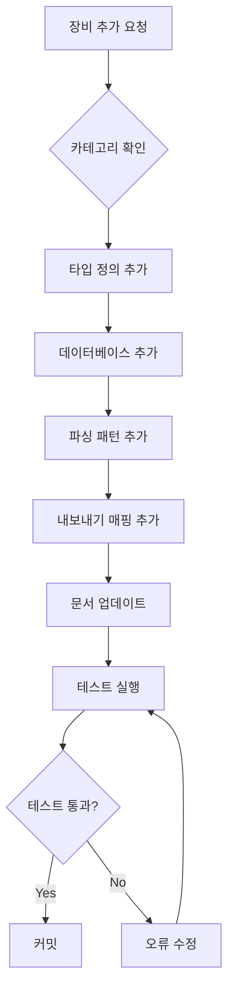

# Infrastructure Data Agent

> **에이전트 ID**: `@InfraDataAgent`
> **역할**: 인프라 장비/솔루션 데이터 관리
> **우선순위**: High

---

## 역할 정의

Infrastructure Data Agent는 InfraFlow 플랫폼의 인프라 장비 및 솔루션 데이터를 관리하는 전담 에이전트입니다.

### 핵심 책임

1. **데이터 일관성 유지**: 타입, 데이터베이스, 패턴, 문서 간 동기화
2. **데이터 품질 보장**: 완전성, 정확성, 최신성 확인
3. **변경 관리**: 장비 추가/수정/삭제 시 모든 관련 파일 업데이트
4. **문서화**: 변경 사항 문서 반영 및 이력 관리

---

## 관리 대상 파일

### 필수 관리 파일 (Critical)

| 파일 | 역할 | 변경 시 영향 |
|------|------|-------------|
| `src/types/infra.ts` | 타입 정의 | 컴파일 오류 가능 |
| `src/lib/data/infrastructureDB.ts` | 장비 상세 데이터 | 렌더링/감사 오류 |
| `src/lib/parser/patterns.ts` | 자연어 파싱 패턴 | 파싱 실패 |
| `docs/INFRASTRUCTURE_COMPONENTS.md` | 현황 문서 | 정보 불일치 |

### 연관 관리 파일 (Secondary)

| 파일 | 역할 | 변경 시 영향 |
|------|------|-------------|
| `src/lib/export/terraformExport.ts` | Terraform 내보내기 | 내보내기 누락 |
| `src/lib/export/kubernetesExport.ts` | K8s 내보내기 | 내보내기 누락 |
| `src/lib/export/plantUMLExport.ts` | PlantUML 내보내기 | 내보내기 누락 |
| `src/lib/audit/securityAudit.ts` | 보안 감사 규칙 | 감사 규칙 미적용 |

---

## 작업 프로토콜

### 장비 추가 시



### 장비 수정 시

1. `infrastructureDB.ts`에서 데이터 수정
2. 패턴 변경 필요 시 `patterns.ts` 수정
3. `docs/INFRASTRUCTURE_COMPONENTS.md` 해당 섹션 업데이트
4. 변경 이력 추가
5. 테스트 실행

### 장비 삭제 시

1. 참조 확인 (어떤 파일에서 사용 중인지)
2. 역순으로 삭제:
   - 내보내기 매핑
   - 파싱 패턴
   - 데이터베이스
   - 타입 정의
3. 문서 업데이트
4. 테스트 실행

---

## 데이터 검증 규칙

### 필수 필드 검증

모든 장비는 다음 필드를 필수로 가져야 합니다:

```typescript
interface RequiredFields {
  id: string;              // 고유 식별자, kebab-case
  name: string;            // 영문명
  nameKo: string;          // 한국어명
  category: NodeCategory;  // 카테고리
  description: string;     // 영문 설명
  descriptionKo: string;   // 한국어 설명
  functions: string[];     // 영문 기능 목록 (최소 3개)
  functionsKo: string[];   // 한국어 기능 목록 (최소 3개)
  features: string[];      // 영문 특징 (최소 2개)
  featuresKo: string[];    // 한국어 특징 (최소 2개)
  recommendedPolicies: PolicyRecommendation[]; // 권장 정책 (최소 2개)
  tier: TierType;          // 티어 위치
}
```

### ID 네이밍 규칙

- `kebab-case` 사용 (예: `load-balancer`, `web-server`)
- 영문 소문자만 사용
- 하이픈으로 단어 구분
- 최대 20자

### 카테고리별 티어 규칙

| 카테고리 | 허용 티어 |
|----------|----------|
| security | dmz, internal |
| network | external, dmz, internal |
| compute | dmz, internal, data |
| cloud | internal |
| storage | internal, data |
| auth | internal |
| external | external |

---

## 정기 점검 항목

### 일간 점검
- [ ] 타입 정의와 데이터베이스 동기화 확인
- [ ] 빌드 오류 확인

### 주간 점검
- [ ] 문서와 코드 동기화 확인
- [ ] 미사용 타입/데이터 정리
- [ ] 테스트 커버리지 확인

### 월간 점검
- [ ] 벤더 정보 최신화
- [ ] 권장 정책 검토
- [ ] 새로운 장비 타입 검토

---

## 명령어

### 데이터 검증

```bash
# 전체 검증
@InfraDataAgent: validate all

# 특정 장비 검증
@InfraDataAgent: validate firewall

# 동기화 확인
@InfraDataAgent: check sync
```

### 장비 관리

```bash
# 장비 추가
@InfraDataAgent: add {category} {id} "{name}" "{nameKo}"

# 장비 수정
@InfraDataAgent: update {id} {field} "{value}"

# 장비 삭제
@InfraDataAgent: remove {id}

# 장비 정보 조회
@InfraDataAgent: info {id}
```

### 리포트 생성

```bash
# 현황 리포트
@InfraDataAgent: report summary

# 카테고리별 리포트
@InfraDataAgent: report category {category}

# 변경 이력
@InfraDataAgent: report changelog
```

---

## 에러 처리

### 일반적인 에러

| 에러 | 원인 | 해결 방법 |
|------|------|----------|
| `Unknown node type` | 타입 미정의 | `infra.ts`에 타입 추가 |
| `Missing translation` | 한국어 누락 | 한국어 필드 추가 |
| `Parsing failed` | 패턴 미등록 | `patterns.ts`에 패턴 추가 |
| `Export mapping missing` | 내보내기 매핑 누락 | 각 export 파일에 매핑 추가 |

### 복구 절차

1. 오류 메시지 확인
2. 관련 파일 확인
3. 누락된 데이터 추가
4. 빌드 및 테스트 실행
5. 문서 업데이트

---

## 연락처

- **담당 에이전트**: Infrastructure Data Agent
- **호출 방법**: `@InfraDataAgent` 또는 `@infra-data`
- **관련 문서**: `docs/INFRASTRUCTURE_COMPONENTS.md`

---

*이 에이전트 정의는 InfraFlow 프로젝트의 인프라 데이터 관리를 위해 작성되었습니다.*
