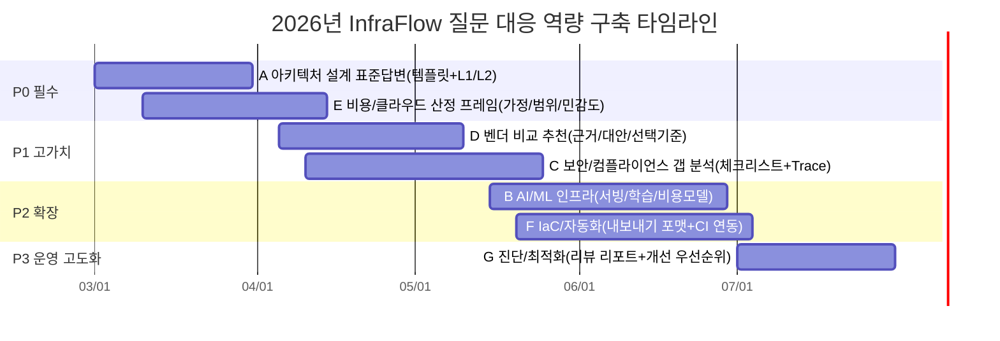
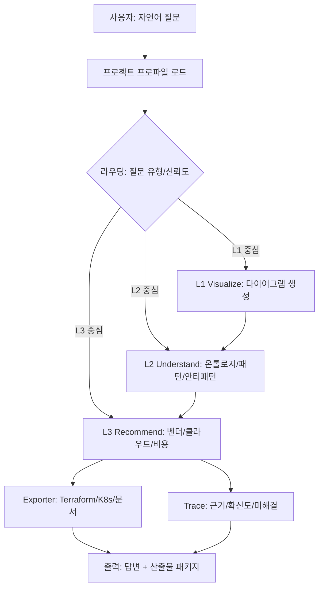

# Claude Code 기반 InfraFlow 답변 검증 및 서비스화 제안 보고서

## Executive Summary

본 보고서는 사용자가 제공한 **타깃 페르소나(10종)** 및 **예상 질문 100개**를 입력으로, “InfraFlow(시각화→이해→추천)” 철학에 맞춰 **실제 서비스에서 답변이 어떤 품질·형태로 나와야 하는지**를 검증 기준과 샘플 답변으로 구체화했다. (입력 문서 기준일: **2026-02-25, Asia/Seoul**)

검증의 핵심은 “그럴듯한 답”이 아니라, **(1) 구조화된 산출물(L1) + (2) 근거와 트레이드오프(L2) + (3) 실행 가능한 추천과 이행 산출물(L3)**이 한 번의 응답에서 일관되게 제공되는지 여부다. 이는 Claude Code가 강조하는 **에이전트형 작업 루프(도구 활용·검증·자동화)**를 제품화된 Q&A로 치환한 형태로 볼 수 있다. Claude Code는 모델 추론에 파일/실행/검색/웹 접근 등 내장 도구를 결합해 과업을 수행하며, 확장 계층(예: Skills, MCP, Hooks)이 에이전트 루프의 다양한 지점에 연결된다고 설명한다. 

결론적으로, 100문항을 A~G 7개 영역으로 분류했을 때 **최우선 개발·검증 대상은 “아키텍처 설계(A) + 비용/클라우드(E) + 벤더 추천(D)”**이며(빈도와 사업가치가 높음), 보안/컴플라이언스(C)는 난이도는 높지만 **신뢰/차별화의 핵심**이므로 “근거·추적(Trace)” 기능과 결합해 단계적으로 강화하는 전략이 타당하다. AWS Well-Architected Framework가 6개 기둥(운영우수성/보안/신뢰성/성능효율/비용최적화/지속가능성)로 아키텍처를 점검하는 방식은, G(진단) 및 E(비용) 유형 답변의 표준 “검증 프레임”으로 재사용하기에 적합하다. 

---

## 입력 자료와 가정

### 입력 자료 현황

| 항목 | 상태 | 요약 | 비고 |
|---|---:|---|---|
| 페르소나 | 제공됨 | P1~P10 총 10종(CTO, 컨설턴트, IT관리자, 아키텍트, 보안/CISO, AI/ML, SRE, 교육자, 공공, MSP) | 사용자 제공 문서 기반 |
| 질문 리스트 100개 | 제공됨 | A~G 7개 카테고리로 총 100문항(각 문항에 대상 페르소나 매핑) | 사용자 제공 문서 기반 |
| InfraFlow 기능/의의 정의 | 제공됨 | 3계층 가치 구조(Visualize→Understand→Recommend), 온톨로지/지식그래프, RAG·추론투명성, 내보내기(IaC) 등 | 사용자 제공 문서 기반 |
| Claude Code “infraflow” 원문 위치 | 미제공 | 본 보고서는 공개 Claude Code Docs를 조사했으나 “infraflow”가 고유 기능명으로 명시된 원문은 확인 범위 내에서 특정하지 못함 | 따라서 “InfraFlow 정의서”를 ‘infraflow 기능/의의’의 1차 규범으로 사용 |

### 가정 목록

| 가정 | 이유 | 영향 |
|---|---|---|
| “infraflow”는 **InfraFlow 플랫폼이 제공해야 하는 답변 경험(흐름)**을 의미한다 | 질문이 ‘기능/의의에 따라 답변 검증’ 형태이며, 제공 문서가 기능 정의를 포함 | 답변 템플릿을 “L1-L2-L3 연쇄”로 고정 |
| 사용자는 답변에서 **다이어그램/근거/추천**을 동시에 기대한다 | InfraFlow 정의가 3계층 가치를 명시 | “요약만” 제공하는 답변은 Fail 처리 |
| 보안·규제 질문은 “정답 단정”보다 **근거 기반 체크리스트/갭 분석**이 적합하다 | 규정은 범위·산업·데이터분류에 따라 달라짐 | 보안 답변은 전제·범위 규정이 필수 |
| 서비스 운영형 답변은 **자동 검증(사후 검증/룰체크) + 추적(Trace)**가 필요 | Claude Code 및 현대 에이전트 워크플로우는 검증 가능성을 중시 citeturn5view1turn5view3 | “출처 없는 추천”을 제한하고 evidence 패널 제안 |

---

## Claude Code 관점에서 재정의한 InfraFlow의 의미

InfraFlow 정의서가 제시하는 핵심은 “인프라를 그리는 도구”가 아니라 **인프라 컨설팅의 전 과정을 자동화하는 에이전트형 흐름(Flow)**이다. 이를 Claude Code 관점으로 해석하면, 다음과 같이 정리된다.

### 에이전트 루프의 제품화

Claude Code는 단순 챗봇이 아니라 **파일을 읽고, 명령을 실행하고, 변경을 수행하는 에이전트형 환경**으로 설명되며, 확장 계층(Skills, MCP, Hooks 등)이 에이전트 루프의 지점에 연결된다고 안내한다. citeturn5view0turn5view1 이 구조는 InfraFlow가 지향하는 “설계→검증→추천→산출물 생성”의 단계형 답변과 자연스럽게 대응된다.

| Claude Code 개념 | InfraFlow로 치환 | 기대 효과 |
|---|---|---|
| “컨텍스트를 추가(항상 켜진 규칙/지식)” | 업종·규모·데이터 분류·제약 조건을 “프로젝트 프로파일”로 저장 | 재질문 감소, 일관성 확보 |
| Skills(재사용 가능한 워크플로우) citeturn5view0 | “아키텍처 패턴 템플릿”, “비용 산정 루틴”, “컴플라이언스 체크” | 답변 표준화·속도 향상 |
| MCP로 외부 도구/데이터 연결 citeturn5view2 | 가격 API, 사내 CMDB, 보안 정책 저장소, 리소스 인벤토리 연결 | 정확도·현실성(현황 반영) 상승 |
| Hooks(결정론적 스크립트) citeturn5view3 | “민감정보 마스킹”, “정적 정책 검사”, “답변 출력 스키마 강제” | 보안/품질 자동 게이트 |

### InfraFlow가 해결하려는 ‘복잡성’의 본질

InfraFlow 정의서의 문제인식은 “이해관계자(벤더/고객/SI/주니어)가 전체 그림을 보지 못한다”는 것이다. 이를 외부 표준 관점에서 보면, 보안·컴플라이언스·아키텍처는 모두 **‘증빙 가능한 관리체계/통제’**로 귀결된다.

- 예: ISO/IEC 27001은 ISMS 요구사항(수립·구현·유지·지속개선)과 **리스크 기반 접근**을 강조한다. citeturn10search0  
- 예: SOC 2는 서비스 조직의 통제가 보안/가용성/처리무결성/기밀성/프라이버시에 관련됨을 보고서 형태로 다룬다. citeturn9search1  
- 예: HIPAA Security Rule은 전자적 건강정보 보호를 위해 **관리적·물리적·기술적 보호조치**를 요구한다. citeturn9search0  
- 예: EU 집행기관 및 EDPB는 GDPR이 EU/EEA 내 또는 EU 대상 처리에 적용되고, 기술중립적이며, 2018년부터 적용됨을 설명한다. citeturn12search1turn12search2  

따라서 “infraflow 기능/의의”는 곧 **(A) 도식화로 ‘공통 언어’ 생성 → (B) 근거·통제·패턴으로 ‘검증 가능성’ 제공 → (C) 선택지를 구체 제품/서비스/코드로 ‘실행’ 가능하게 만드는 흐름**이다.

---

## 검증 목표와 기대 모범답변 기준

본 절은 100개 질문에 공통 적용할 “모범 답변 기준”을 정의한다(정확성·완전성·친절성·기술 깊이·길이·보안/프라이버시).

### 평가 기준 정의

| 기준 | 합격 정의 | 실패 패턴(예시) | 자동화 가능한 검사 |
|---|---|---|---|
| 정확성 | 사실/원칙/정의가 표준 문서·공식 문서와 충돌하지 않음 | “규정상 반드시” 등 단정했으나 근거/범위 없음 | RAG 근거 링크, 룰 기반 금지어(단정) |
| 완전성 | 질문 유형에 필요한 필수 항목(아키텍처·데이터·보안·운영·비용 등)을 빠짐없이 포함 | DB/네트워크/관측성(로그·메트릭) 누락 | 체크리스트 커버리지 스코어 |
| 친절성 | 페르소나 수준에 맞는 용어·설명, 단계적 안내 | 전문가에게 과잉설명 / 초보자에게 약어 남발 | 페르소나별 용어 난이도 사전 |
| 기술적 깊이 | 트레이드오프·대안·한계·운영 고려 포함 | “이게 좋아요” 수준 추천 | 대안 제시 여부, 위험/한계 섹션 유무 |
| 응답 길이 | 질문 난이도 대비 충분(요약+세부), 과도한 장문 회피 | 너무 짧아 실행 불가 | 토큰 범위 정책, 요약/본문 분리 |
| 보안/프라이버시 | 민감정보 요구 금지, 데이터 분류/접근통제/보존 등 언급 | 키/계정/실데이터 요청·노출 | 마스킹 훅, PII 탐지 훅 |

### 모범답변 템플릿

아래 템플릿은 “한 번의 답변에서 L1→L2→L3를 완성”하기 위한 최소 구조다.

| 섹션 | 목적 | 필수 출력 | 관련 표준/근거 |
|---|---|---|---|
| 요약 | 즉시 의사결정 가능하게 | 3~5줄 핵심 결론 | (필요시) AWS WA 6 pillars citeturn6search3 |
| 전제·확인 | 오판 방지 | 트래픽, 데이터, SLA, 규제 범위 등 5~8개 | GDPR 적용 범위/원칙 참고 가능 citeturn12search1turn12search5 |
| L1 시각화 | 공통 언어 생성 | 컴포넌트 목록 + 데이터흐름(텍스트/다이어그램) | K8s Service/Ingress 개념 등 citeturn15search3turn15search0 |
| L2 이해 | 설계 타당성 | 패턴/안티패턴, 트레이드오프, 운영 포인트 | OWASP Top 10 등 위험 참고 citeturn18search1 |
| L3 추천 | 실행 가능화 | 2~3개 옵션(클라우드/벤더), 선택 기준, 대략 비용 범위 | SOC2/ISO/PCI 등 요구와 매핑 citeturn9search1turn10search0turn13search1 |
| 산출물 | 바로 착수 | IaC/매니페스트/체크리스트/테스트 계획 | Terraform 모듈 구조·import 설명 citeturn14search10turn14search0 |
| Trace | 신뢰 확보 | 근거 링크/정책 룰/확신도/미해결 이슈 | Claude Code Hooks·MCP로 자동화 citeturn5view2turn5view3 |

---

## 질문 분류와 우선순위화 결과

### 기능별·주제별 분류

질문 100개는 이미 A~G로 구분되어 있으며, 이는 InfraFlow 기능 레이어(L1~L3)와 직접 연결된다.

| 카테고리 | 문항 수 | 대표 페르소나 | 주된 레이어 성격 |
|---|---:|---|---|
| A 아키텍처 설계 | 20 | P1/P4/P7 | L1 중심 + L2 필수 |
| B AI/ML 인프라 | 15 | P6/P1/P4 | L1+L2+L3 혼합 |
| C 보안/컴플라이언스 | 15 | P5/P9/P2 | L2 중심 + L3(갭/통제) |
| D 벤더 비교/추천 | 15 | P2/P3/P5 | L3 중심(근거 필수) |
| E 클라우드/비용 | 15 | P1/P4/P7 | L3 중심 + L2(원가/운영) |
| F IaC/자동화 | 10 | P7/P2 | L3(산출물) + 실행 |
| G 진단/최적화 | 10 | P3/P4/P7 | L2(리뷰) + L3(개선안) |

### 우선순위 산정

우선순위는 (중요도×빈도)/난이도 가중으로 산정했다(정성+정량 혼합).

| 카테고리 | 빈도(문항) | 중요도(1~5) | 난이도(1~5) | 우선순위 점수 | 권장 등급 |
|---|---:|---:|---:|---:|---|
| A 아키텍처 설계 | 20 | 5 | 3 | 8.33 | P0 |
| E 클라우드/비용 | 15 | 5 | 3 | 6.25 | P0 |
| D 벤더 비교/추천 | 15 | 4 | 3 | 5.00 | P1 |
| C 보안/컴플라이언스 | 15 | 5 | 4 | 4.69 | P1 |
| B AI/ML 인프라 | 15 | 4 | 4 | 3.75 | P2 |
| F IaC/자동화 | 10 | 4 | 3 | 3.33 | P2 |
| G 진단/최적화 | 10 | 4 | 4 | 2.50 | P3 |

### 그룹별 대표 질문 선정

요구조건(각 그룹 10~15개)에 맞춰 대표 질문을 선정했다.

**A 대표 질문(12개)**

| # | 질문 |
|---:|---|
| 1 | 월 사용자 10만 명 SaaS 인프라 설계 |
| 3 | 마이크로서비스 이커머스 설계 |
| 4 | 글로벌 CDN + 멀티리전 설계 |
| 6 | 동시접속 1만 실시간 채팅 설계 |
| 8 | 온프레미스–클라우드 하이브리드 설계 |
| 9 | DR Active-Standby 설계 |
| 11 | 방화벽→WAF→LB→웹→API→DB 연결 |
| 12 | AWS 기준 MVP 최소비용 설계 |
| 14 | 데이터레이크+분석 파이프라인 설계 |
| 15 | 금융권 내부망 규정 준수 아키텍처 |
| 17 | 멀티테넌시 SaaS 설계 |
| 20 | SaaS 멀티테넌트 격리 & 운영 모델 |

**B 대표 질문(11개)**

| # | 질문 |
|---:|---|
| 21 | RAG 기반 챗봇 인프라 설계 |
| 22 | MLOps 파이프라인 추천 |
| 23 | vLLM vs TGI vs TensorRT-LLM |
| 24 | GPU 스케줄링/오토스케일 |
| 26 | 프롬프트/모델 버전 관리 |
| 27 | LLM 추론 비용 계산 |
| 28 | 온프레미스 vs 클라우드 GPU |
| 29 | LLM 파인튜닝 인프라 |
| 30 | 학습/추론 클러스터 분리 |
| 31 | 벡터DB 선택 |
| 32 | 모델 서빙 장애 대비 |

**C 대표 질문(11개)**

| # | 질문 |
|---:|---|
| 36 | Zero Trust 적용 |
| 37 | 데이터 암호화/키 관리 |
| 39 | 보안 안티패턴 진단 |
| 41 | 개인정보 저장/분리 아키텍처 |
| 42 | ISMS-P 대비 망분리 검토 |
| 43 | 금융권 방화벽/WAF 구성 |
| 44 | DDoS 대응 |
| 46 | PCI DSS 대응 설계 |
| 47 | SOC2 대비 로깅/감사 |
| 49 | GDPR 준수 설계 |
| 50 | IAM/RBAC 설계 |

**D 대표 질문(11개)**

| # | 질문 |
|---:|---|
| 51 | AWS vs Azure vs GCP 선택 |
| 52 | K8s vs ECS vs VM |
| 53 | Cloudflare WAF vs AWS WAF vs Azure WAF vs Cloud Armor |
| 54 | FortiGate vs Palo Alto vs Cisco 방화벽 |
| 55 | RDS vs Aurora vs Cloud SQL |
| 56 | Kong vs AWS API Gateway vs NGINX Ingress |
| 57 | Redis vs Memcached |
| 59 | EKS vs AKS vs GKE |
| 60 | S3 vs Blob vs GCS |
| 62 | Datadog vs Grafana+Prometheus |
| 63 | SIEM 추천 |

**E 대표 질문(11개)**

| # | 질문 |
|---:|---|
| 66 | 온프레미스→AWS 마이그레이션 |
| 67 | 리전 선택 |
| 69 | 월 1천만 요청 비용 산정 |
| 70 | 서버리스 vs 컨테이너 |
| 71 | RI vs Savings vs Spot |
| 72 | 비용 폭증 원인 분석 |
| 73 | 스토리지 비용 최적화 |
| 74 | 멀티클라우드 비용/관리 |
| 75 | 3년 TCO 산정 |
| 78 | 스타트업–엔터프라이즈 비용 전략 |
| 80 | “예산 500만원” 내 설계 |

**F 대표 질문(10개)**

| # | 질문 |
|---:|---|
| 81 | 다이어그램→Terraform |
| 82 | CloudFormation 변환 |
| 83 | K8s YAML 생성 |
| 84 | Terraform 모듈 구조 |
| 85 | CI/CD 자동 배포 파이프라인 |
| 86 | GitOps 연계 |
| 87 | IaC 보안검사 |
| 88 | 로그/모니터링 템플릿 |
| 89 | 정책/가드레일 자동 |
| 90 | PRD→Infra 초안 |

**G 대표 질문(10개)**

| # | 질문 |
|---:|---|
| 91 | SPOF 식별 |
| 92 | 지연 원인 분석 |
| 93 | 데이터 흐름 병목 |
| 94 | 캐시 전략 개선 |
| 95 | SLA 99.9/99.99 구성 차이 |
| 96 | 모니터링 공백 식별 |
| 97 | DB 이중화 구성 |
| 98 | LB 뒤 서버 1대 문제 |
| 99 | 비용 대비 성능 개선 |
| 100 | AWS Well-Architected 기준 리뷰 |

### 우선순위 타임라인



---

## 대표 질문 샘플 답변

아래 샘플은 “서비스에서 실제로 사용자에게 반환되어야 하는 답변 형태”를 보여주며, 각 답변은 **요약→전제→L1→L2→L3→산출물/다음단계**의 축약형을 따른다.

### A 아키텍처 설계 샘플

| 질문 | 페르소나 | 샘플 답변 |
|---|---|---|
| #1 월 사용자 10만 SaaS 설계 | P1 CTO | **요약:** 초기에는 ‘단순·관리형·확장 가능’이 핵심입니다. <br><br>**전제:** 월 10만 MAU/피크 DAU, 인증 방식, 쓰기/읽기 비율, DB 트랜잭션 특성, SLA(예: 99.9), 개인정보 여부. <br><br>**L1(시각화):** `CDN → WAF → LB → 웹/API(오토스케일) → 캐시 → DB(멀티AZ) → 객체스토리지` + 로그/모니터링. <br><br>**L2(이해):** 웹/API는 무상태로 오토스케일, DB는 멀티AZ로 HA, 캐시는 핫데이터·세션·레이트리밋에 사용. <br><br>**L3(추천):** (옵션A) 관리형 컨테이너+관리형 DB / (옵션B) 서버리스+관리형 NoSQL. “개발속도 vs 비용예측/벤더종속” 트레이드오프를 비교. <br><br>**산출물:** 초안 다이어그램 + MVP 기준 IaC(네트워크·컴퓨트·DB) 스켈레톤. |
| #6 동시접속 1만 실시간 채팅 | P7 SRE | **요약:** WebSocket/실시간은 “연결 유지”가 비용·스케일을 좌우합니다. <br><br>**전제:** 메시지 보장(At-least-once?), 방/그룹 구조, 오프라인 메시지, 읽음 처리, 지역 분산 필요 여부. <br><br>**L1:** `LB(Sticky/WS) → WS 게이트웨이(수평확장) → Pub/Sub(브로커) → 채팅 저장소 → 푸시/알림` + 관측성. <br><br>**L2:** 연결은 게이트웨이에서 종단, 메시지는 브로커로 팬아웃. 브로커는 “순서/지연/운영난이도”에 따라 선택. <br><br>**L3:** (저비용) 단일 리전+자동확장, (고가용) 멀티리전+지리 라우팅. KPI(동접, p95 지연, 유실률) 기준으로 용량계획. |
| #12 AWS MVP 최소비용 설계 | P1 CTO | **요약:** MVP는 “고정비 최소화”가 우선이며, 운영인력을 줄이는 구성이 유리합니다. <br><br>**전제:** 트래픽 불확실성, 기능 범위, DB 스키마 유연성, 배치 작업 유무. <br><br>**L1:** `정적 프론트(객체스토리지+CDN) → API(서버리스) → 관리형 DB/NoSQL` + 기본 WAF/모니터링. <br><br>**L2:** 서버리스는 아이들 비용을 줄이지만, 트래픽 증가 시 비용곡선이 빨라질 수 있어 “단위 요청 비용”을 같이 봐야 합니다. citeturn6search1 <br><br>**L3:** (옵션A) 서버리스 중심(속도/운영↓) vs (옵션B) 소형 VM+오토스케일(예측/최적화↑). <br><br>**산출물:** 초기 예산 상한을 넣은 비용 민감도 표(요청수·DB용량·CDN전송량). |

### B AI/ML 인프라 샘플

| 질문 | 페르소나 | 샘플 답변 |
|---|---|---|
| #21 RAG 챗봇 인프라 | P6 AI/ML | **요약:** RAG는 “수집/정제→임베딩→인덱싱→검색→생성→평가·모니터링”으로 쪼개야 안정적입니다. <br><br>**전제:** 문서 형태(PDF/웹), 업데이트 주기, 보안등급, 응답 SLA, 환각 허용도. <br><br>**L1:** `수집 파이프라인 → 청킹/정제 → 임베딩 → 벡터 인덱스 → 리트리버 → LLM 서빙 → 응답 캐시/가드레일 → 로그/평가` <br><br>**L2:** 검색 품질(Recall)과 비용은 청킹/임베딩/인덱스 파라미터가 좌우. “평가셋”으로 회귀 테스트를 붙여야 합니다. <br><br>**L3:** 초기엔 단일 인덱스/단일 모델, 성장 시 멀티 인덱스(부서/보안등급)와 모델 라우팅. |
| #23 vLLM vs TGI vs TensorRT-LLM | P6 AI/ML | **요약:** 셋 다 “고성능 서빙”이 목표지만, 운영 포지션이 다릅니다. <br><br>**vLLM:** 고처리량·메모리 효율(PagedAttention, 연속 배칭, OpenAI 호환 API) 강점을 명시. citeturn20search3turn20search0 <br>**TGI:** LLM 서빙 툴킷이며, SSE 스트리밍/연속 배칭/관측성(OTel/Prometheus)을 제공. citeturn19search0turn19search1 또한 일부 문서에서 “maintenance mode” 안내가 있어 신규 선택 시 로드맵 확인이 필요합니다. citeturn19search3turn19search2 <br>**TensorRT-LLM:** NVIDIA GPU에서 TensorRT 엔진 기반 최적화로 고성능 추론을 목표로 하는 라이브러리/런타임. citeturn19search5turn19search6 <br><br>**권장 선택 기준:** (1) 하드웨어(NVIDIA 중심인지), (2) API 호환(OpenAI), (3) 배포/운영 난이도, (4) 관측성/튜닝 포인트. |
| #30 학습/추론 클러스터 분리 | P4 아키텍트 | **요약:** 분리의 목적은 “비용/격리/스케일 특성”을 다르게 가져가기 위함입니다. <br><br>**L1:** `학습: GPU 대형+고대역 네트워크+분산 스토리지` / `추론: GPU 중·소형+오토스케일+캐시+API 게이트웨이` <br><br>**L2:** 학습은 장시간·고정형, 추론은 스파이크·지연 민감. 동일 클러스터는 서로의 SLO를 깨기 쉽습니다. <br><br>**L3:** 학습은 스팟/프리엠티블 혼합 + 체크포인트 전략, 추론은 “안정성 우선(예약/온디맨드)”로 비용 모델을 분리. |

### C 보안 컴플라이언스 샘플

| 질문 | 페르소나 | 샘플 답변 |
|---|---|---|
| #39 보안 안티패턴 진단 | P5 보안 | **요약:** “인터넷 직접노출 + 과권한 + 로그 부재”가 가장 흔한 조합입니다. <br><br>**L1:** 구성요소별 노출면(Edge/API/DB/관리자) 표시. <br><br>**L2:** OWASP Top 10은 웹앱 핵심 위험(예: 접근통제 실패, 설정오류, 로깅/모니터링 실패 등)을 ‘표준 인식 문서’로 제시합니다. citeturn18search1 이를 기반으로 **WAF/인증/로깅** 누락을 안티패턴으로 탐지. <br><br>**L3:** 각 안티패턴에 대해 “최소 조치(1주)”와 “권장 조치(1~2개월)”로 개선안 2단계를 제시. |
| #42 ISMS-P 대비 망분리 검토 | P9 공공 | **요약:** ISMS-P는 인증기준 체계를 갖추고(관리체계·보호대책·개인정보 단계별), 네트워크/접근통제/암호화/운영관리 등 통제가 함께 요구됩니다. citeturn7search2 <br><br>**전제:** 대상 시스템 범위(업무망/인터넷망), 외부접속 형태, 개인정보·중요정보 흐름, 위탁/클라우드 사용 여부. <br><br>**L1:** 망 영역(업무망/인터넷망/관리망)과 데이터 흐름(반출/반입 포인트) 도식화. <br><br>**L2:** 망분리는 “경로 통제+접근권한+기록+암호화”가 함께 설계되어야 증빙이 쉬움. <br><br>**L3:** (조직 정책에 따라) DLP/접근통제/감사로그/암호화 키관리 체크리스트로 갭 분석 리포트 생성. <br><br>**참고:** 금융권의 경우 2026-01-20~02-09 기간 ‘망분리 예외(SaaS)’ 제도개선 사전예고가 있었으나, 이는 산업별 규율이므로 공공/ISMS-P에 그대로 등치하면 안 됩니다. citeturn8search4 |
| #47 SOC2 대비 로깅/감사 | P5 보안 | **요약:** SOC 2는 서비스 조직의 통제가 보안·가용성·처리무결성·기밀성·프라이버시와 관련됨을 다루는 보고서입니다. citeturn9search1 <br><br>**L1:** “로그 소스(앱/인프라/DB/IAM)→중앙 수집→보관→탐지→대응” 파이프라인. <br><br>**L2:** 핵심은 “변조 방지, 보관기간, 접근통제, 추적가능성”이며, 권한 변경/관리자 행위/데이터 접근은 별도 하이라이트. <br><br>**L3:** 90일(또는 계약 요구) 기준 단계별 로드맵(도구 선정→정책→운영절차→내부감사) 제안. |

### D 벤더 비교 추천 샘플

| 질문 | 페르소나 | 샘플 답변 |
|---|---|---|
| #53 Cloudflare WAF vs AWS WAF vs Azure WAF vs Cloud Armor | P5 보안 | **요약:** 비교 축은 “배치 위치(Edge vs Cloud LB) / 룰 관리 / 관측성 / 비용 / 운영 인력”입니다. <br><br>**L1:** 트래픽 경로(사용자→Edge→LB→앱)에서 WAF 삽입 위치 2안 도식화. <br><br>**L2:** 규칙(관리형 룰, 커스텀 룰), 봇/레이어7 DDoS, 로그/탐지 연계를 각각 점검. <br><br>**L3:** 선택 기준(다클라우드, 이미 사용하는 CDN, SOC2/감사 요구, 팀 역량)에 따라 2~3개 옵션 제시. <br><br>참고로 entity["company","Cloudflare","internet security company"] 같은 독립형 Edge와 클라우드 네이티브 WAF는 운영 포인트가 다르므로 “현재 라우팅·계약·관제”를 함께 평가해야 합니다. |
| #56 Kong vs AWS API Gateway vs NGINX Ingress | P2 컨설턴트 | **요약:** “관리형 게이트웨이 vs 쿠버네티스 인그레스 vs 독립형 API 게이트웨이”의 선택입니다. <br><br>**L1:** 외부 API 진입점(게이트웨이)과 내부 서비스 디스커버리/라우팅 구성. <br><br>**L2:** Kubernetes의 Ingress는 HTTP/HTTPS 외부 라우팅을 제공하지만, 프로젝트에서는 Gateway 사용을 권장하고 Ingress API는 기능 확장이 동결되었다고 명시합니다. citeturn15search0 <br><br>**L3:** 요구 기능(인증/레이트리밋/정책/멀티테넌시/관측성) 매트릭스로 “필수/선택”을 정해 추천. |
| #62 Datadog vs Grafana+Prometheus | P7 SRE | **요약:** “구축/운영 부담 vs 즉시 가시성/통합”의 교환입니다. <br><br>**L1:** 메트릭/로그/트레이스 수집 경로와 저장 위치를 도식화. <br><br>**L2:** 장애 대응은 “스파이크 탐지→원인 추적(트레이스)→롤백/완화”의 시간 단축이 핵심. <br><br>**L3:** (소규모) 관리형+표준 대시보드 / (대규모) 오픈소스 스택+운영 표준화. 비용은 “호스트/컨테이너/로그GB/트레이스샘플링” 단위로 비교 표 구성. |

### E 클라우드 비용 샘플

| 질문 | 페르소나 | 샘플 답변 |
|---|---|---|
| #69 월 1천만 요청 비용 산정 | P1 CTO | **요약:** 비용은 “요청당 비용 + 데이터 전송 + DB/캐시 + 관측성”으로 분해해야 합니다. <br><br>**전제:** 요청당 평균 응답 크기, 캐시 히트율, 피크 QPS, DB 쿼리 수, 리전, 가용성 요구. <br><br>**L2:** AWS 비용 최적화 문서는 비용 최적화가 “Cloud Financial Management, 사용량 인식, 수요/공급 관리, 지속적 최적화”로 구성됨을 강조합니다. citeturn6search1 <br><br>**L3:** (1) 보수적 상한, (2) 캐시 최적화 후, (3) 서버리스/컨테이너 전환 후 3가지 시나리오 비용 범위 제공. |
| #71 RI vs Savings vs Spot | P4 아키텍트 | **요약:** 장기·예측 가능한 베이스는 할인계약, 스파이크/배치는 스팟, 가변 워크로드는 유연성을 우선합니다. <br><br>**L1:** 워크로드를 “항상 켜짐/주간 피크/배치” 3분류로 태깅. <br><br>**L2:** 비용 최적화는 지속 프로세스이며, 조직의 재무·운영 모델에 맞는 체계가 필요합니다. citeturn6search1 <br><br>**L3:** 추천은 “베이스 60~80% 안정화 + 피크 20~40% 탄력”처럼 비율 가이드와 함께, 중단 허용/체크포인트 가능성에 따라 조정. |
| #75 3년 TCO 산정 | P4 아키텍트 | **요약:** 3년 TCO는 비용(직접비)뿐 아니라 운영·보안·장애 비용(간접비)을 포함해야 합니다. <br><br>**L1:** 인프라 구성요소별 CAPEX/OPEX 분해(컴퓨트/스토리지/네트워크/인력/툴). <br><br>**L2:** AWS Well-Architected는 아키텍처를 일관되게 측정·개선하는 틀을 제공하며(6 pillars), TCO의 ‘리스크 비용’ 추정에 도움 됩니다. citeturn6search3turn6search2 <br><br>**L3:** 3안 비교: 온프레미스 유지 / 단일 클라우드 / 하이브리드. 민감도(환율·트래픽 성장·데이터 증가) 표 포함. |

### F IaC 자동화 샘플

| 질문 | 페르소나 | 샘플 답변 |
|---|---|---|
| #81 다이어그램→Terraform | P7 SRE | **요약:** “상태(State) 기반 IaC”로 연결되려면 리소스 주소/모듈 구조부터 표준화해야 합니다. <br><br>**L3 산출물:** VPC/서브넷/보안그룹/ALB/DB 등 핵심 리소스의 `main.tf/variables.tf/outputs.tf` 스켈레톤. Terraform 표준 모듈 구조(README, main, variables, outputs)를 권장 레이아웃으로 제시합니다. citeturn14search10 |
| #84 Terraform 모듈 구조 | P2 컨설턴트 | **요약:** 모듈은 “재사용 단위”를 명확히 하고 예제/문서 자동생성을 가능하게 해야 합니다. HashiCorp는 표준 모듈 구조를 권장하며, 루트 모듈(main/variables/outputs)은 최소 권장 요소라고 설명합니다. citeturn14search10 <br><br>**추천:** 네트워크/컴퓨트/데이터/보안 모듈을 분리하고, 환경(dev/stage/prod)은 루트에서 조합. |
| #87 IaC 보안검사 | P5 보안 | **요약:** IaC는 “배포 전” 잘못된 노출을 잡을 수 있는 가장 강력한 게이트입니다. <br><br>**L2:** (1) 공개 노출(0.0.0.0/0), (2) 암호화 미적용, (3) 과권한 IAM, (4) 로깅 미설정 룰을 자동 체크. <br><br>**L3:** PR 단계에서 정책검사→승인→배포로 이어지는 파이프라인 제안. (Hooks로 정책 강제/중단 같은 결정론 처리가 가능) citeturn5view3 |

### G 진단 최적화 샘플

| 질문 | 페르소나 | 샘플 답변 |
|---|---|---|
| #91 SPOF 식별 | P3 IT | **요약:** SPOF는 “단일 인스턴스/단일 AZ/단일 계정/단일 네트워크 경로”에서 주로 발생합니다. <br><br>**L2:** AWS 신뢰성 문서는 온프레미스에서 단일 장애점·자동화 부족이 신뢰성 달성을 어렵게 한다고 설명하며, 강한 기반·회복 설계를 강조합니다. citeturn6search2 <br><br>**L3:** 개선 우선순위: (1) 멀티AZ, (2) 오토스케일, (3) 백업/복구 리허설, (4) 장애 조치 자동화. |
| #95 SLA 99.9 vs 99.99 | P8 학생 | **요약:** 9가 늘수록 “다운타임 예산”이 급격히 줄어, 중복·운영비가 기하급수로 증가합니다. <br><br>**L1:** 99.9(월 약 43분) vs 99.99(월 약 4분대) 개념 안내. <br><br>**L2:** 가용성 향상은 단순 중복이 아니라 관측/자동복구/변경관리까지 포함됩니다. citeturn6search6turn6search2 |
| #100 AWS Well-Architected 리뷰 | P4 아키텍트 | **요약:** 6 pillars 기준으로 “리스크가 큰 구간부터” 개선안을 내는 방식이 효과적입니다. citeturn6search3 <br><br>**L2:** 신뢰성(장애복구/변경관리), 보안(접근통제/암호화), 비용(태깅/수요공급/최적화) 영역의 질문 리스트 기반으로 갭을 표시. citeturn6search2turn6search1 <br><br>**L3:** 개선 백로그를 “효과(리스크↓)/비용/기간”으로 점수화해 30/60/90일 실행계획 제시. |

---

## 품질평가 매트릭스와 평가 결과 및 개선 권고안

### 품질평가 매트릭스

| 지표 | 정의 | 측정 방법 | 목표 |
|---|---|---|---|
| 정확도 | 표준/공식 문서와의 일치 | RAG 근거 링크 + 룰체크(금지 단정) | High |
| 완전성 | 필수 항목 포함 | 질문 유형별 체크리스트 커버 | 90%+ |
| 친절성 | 페르소나 적합 | 용어 난이도, 설명 단계 | 고정 |
| 기술 깊이 | 트레이드오프/대안 | “대안 2개 이상 + 한계” 포함 | 80%+ |
| 보안/프라이버시 | 민감정보 안전 | 마스킹/PII 탐지/정책 훅 | 0건(누출) |
| Trace | 근거·추적 가능 | “근거/확신도/미해결” 필드 | 100% |
| 응답속도(예상) | UX 지연 | 파이프라인 단계별 SLA | P95 15s 내 |

### 카테고리별 예상 평가 결과

| 카테고리 | 정확도 | 완전성 | 깊이 | 보안/프라이버시 리스크 | 응답속도(예상) | 리스크 요인 |
|---|---:|---:|---:|---:|---:|---|
| A 설계 | 높음 | 중상 | 중상 | 중 | 중 | 제약조건 미확정 시 가정이 늘어남 |
| E 비용 | 중 | 중 | 중 | 중 | 중 | 입력(요청량/전송량/DB)이 부족하면 오차↑ |
| D 추천 | 중 | 중 | 중상 | 중 | 중 | 근거 없는 “브랜드 선호”로 보일 위험 |
| C 보안 | 중 | 중상 | 높음 | 높음 | 중상 | 산업/규정 범위에 따라 단정 위험 |
| B AI/ML | 중 | 중 | 높음 | 중 | 중상 | 서빙 엔진/옵션 변화가 빠름(문서 동기화 필요) citeturn19search2turn20search3 |
| F IaC | 높음 | 중상 | 중 | 중 | 중 | 코드 스켈레톤 품질이 제품 신뢰에 직결 |
| G 진단 | 중상 | 중 | 중상 | 중 | 중 | 관측성 데이터 없이는 “추정 진단” 위험 |

### 개선 권고안 및 자동화 서비스화 제안

#### 개선 권고안

| 영역 | 권고안 | 기대 효과 | 구현 난이도 |
|---|---|---|---|
| 답변 신뢰성 | “Trace 필드”를 모든 응답에 강제(근거, 확신도, 미해결) | 보안/추천 답변 신뢰↑ | 중 |
| 맥락 재사용 | 페르소나 기본 프로파일 + 프로젝트 프로파일 저장 | 반복 질문↓, 일관성↑ | 중 |
| 보안 안전장치 | Hooks로 **PII/키/시크릿 입력 탐지 시 차단** + 마스킹 | 누출 리스크↓ | 중 | 
| 도구 연동 | MCP로 가격/인벤토리/정책 저장소 연결 | 정확도↑, 최신성↑ | 중상 citeturn5view2 |
| 답변 표준화 | Skills 형태로 “아키텍처/비용/보안/진단” 워크플로우 템플릿화 | 응답 속도·품질 균일화 | 중 citeturn5view0 |

#### 서비스 플로우 제안



#### FAQ·문서·API 응답 포맷 제안

| 산출물 | 대상 | 핵심 내용 | 형식 |
|---|---|---|---|
| 챗봇 플로우 | P1/P3 | “요구사항 인터뷰→초안→비용→다음 단계” | 대화 시나리오 |
| FAQ | 전 페르소나 | “왜 이 구성이냐 / 비용이 왜 이러냐 / 보안은?” | 문서 |
| 문서 템플릿 | P2/P4/P7 | 아키텍처 제안서·RFP·운영 Runbook | Markdown/PDF |
| API 응답 | 외부 연동 | 구조화된 JSON(다이어그램/근거/추천/산출물) | REST/JSON |

API 응답 예시(스키마 아이디어):

```json
{
  "summary": "핵심 결론 3~5줄",
  "assumptions": ["트래픽", "SLA", "데이터 분류", "리전", "예산"],
  "layer1_visualize": {
    "nodes": [{"id":"cdn","type":"CDN"}],
    "edges": [{"from":"cdn","to":"waf","flow":"request"}],
    "diagram_format": "mermaid"
  },
  "layer2_understand": {
    "rationale": ["왜 이렇게 연결되는지"],
    "tradeoffs": ["대안과 한계"],
    "anti_patterns": [{"id":"public-db","severity":"high"}]
  },
  "layer3_recommend": {
    "options": [
      {"name":"Option A", "pros":[""], "cons":[""], "est_cost_range_monthly":"..."}
    ],
    "compliance_mapping": [{"framework":"ISMS-P","controls":["2.6 접근통제"]}]
  },
  "artifacts": {
    "terraform": "base64-or-link",
    "k8s_yaml": "base64-or-link",
    "checklist": "base64-or-link"
  },
  "trace": {
    "sources": ["official-doc-link-ids"],
    "confidence": 0.78,
    "open_issues": ["확정 필요: 데이터 보존기간"]
  }
}
```

### 우선 개발 기능 및 리소스 추정

(※ 팀 구성·개발환경이 미제공이므로 “보수적 범위”로 제시)

| 우선순위 | 기능 | 범위 | 필요 역할 | 기간(추정) |
|---:|---|---|---|---:|
| P0 | 답변 템플릿 엔진 | L1/L2/L3 섹션 강제, 체크리스트 커버리지 | PM 0.5, FE 1, BE 1 | 4~6주 |
| P0 | 비용 산정 프레임 | 입력 부족 시 민감도/상한·하한, 비용 최적화 가이드 반영 citeturn6search1 | BE 1, 데이터 0.5 | 4~6주 |
| P1 | 추천 근거화(Trace) | 근거/확신도/미해결 자동 표기 | BE 1, ML 1 | 4~8주 |
| P1 | 보안/컴플라이언스 갭 분석 | ISMS-P 체계 기반 체크리스트 + 보고서 citeturn7search2 | Sec 1, BE 1 | 6~10주 |
| P2 | MCP 도구 연동 | 가격/인벤토리/정책 저장소 | BE 1, DevOps 1 | 6~10주 citeturn5view2 |
| P2 | 내보내기 고도화 | Terraform 모듈 표준·import 워크플로우 가이드 citeturn14search0turn14search10 | FE 1, BE 1 | 6~10주 |
| P3 | 진단 자동화 | Well-Architected 기반 리뷰 리포트 citeturn6search3 | Arch 1, BE 0.5 | 4~8주 |

---

### 출처 및 미제공 사항 명시

- “infraflow 기능/의의”의 **원문(Claude Code가 직접 정의한 문서 위치)**는 사용자로부터 미제공이었고, 공개 Claude Code Docs 조사 범위에서 “infraflow”를 고유 기능명으로 특정하지 못했다. 따라서 본 보고서는 사용자 제공 “InfraFlow 정의서”를 기능 규범으로 사용하고, Claude Code Docs는 **에이전트형 워크플로우(확장·검증·자동화) 원칙**을 뒷받침하는 근거로 사용했다. 

[1] [4] [5] https://code.claude.com/docs/ko/features-overview
https://code.claude.com/docs/ko/features-overview
[2] [27] https://docs.aws.amazon.com/wellarchitected/latest/framework/the-pillars-of-the-framework.html
https://docs.aws.amazon.com/wellarchitected/latest/framework/the-pillars-of-the-framework.html
[3] https://code.claude.com/docs/ko/best-practices
https://code.claude.com/docs/ko/best-practices
[6] [17] https://code.claude.com/docs/ko/mcp
https://code.claude.com/docs/ko/mcp
[7] https://code.claude.com/docs/ko/hooks
https://code.claude.com/docs/ko/hooks
[8] https://www.iso.org/standard/27001
https://www.iso.org/standard/27001
[9] [15] https://www.aicpa-cima.com/topic/audit-assurance/audit-and-assurance-greater-than-soc-2
https://www.aicpa-cima.com/topic/audit-assurance/audit-and-assurance-greater-than-soc-2
[10] https://www.hhs.gov/ocr/privacy/hipaa/administrative/securityrule/index.html
https://www.hhs.gov/ocr/privacy/hipaa/administrative/securityrule/index.html
[11] [12] https://commission.europa.eu/law/law-topic/data-protection/reform/what-does-general-data-protection-regulation-gdpr-govern_en
https://commission.europa.eu/law/law-topic/data-protection/reform/what-does-general-data-protection-regulation-gdpr-govern_en
[13] https://kubernetes.io/docs/concepts/services-networking/service/
https://kubernetes.io/docs/concepts/services-networking/service/
[14] [25] https://owasp.org/Top10/2021/
https://owasp.org/Top10/2021/
[16] [28] https://developer.hashicorp.com/terraform/language/modules/develop/structure
https://developer.hashicorp.com/terraform/language/modules/develop/structure
[18] https://docs.aws.amazon.com/wellarchitected/latest/cost-optimization-pillar/welcome.html
https://docs.aws.amazon.com/wellarchitected/latest/cost-optimization-pillar/welcome.html
[19] vLLM
https://docs.vllm.ai/?utm_source=chatgpt.com
[20] Text Generation Inference
https://huggingface.co/docs/text-generation-inference/main/index?utm_source=chatgpt.com
[21] Text Generation Inference
https://huggingface.co/docs/text-generation-inference/index?utm_source=chatgpt.com
[22] NVIDIA TensorRT-LLM - NVIDIA Docs
https://docs.nvidia.com/tensorrt-llm/?utm_source=chatgpt.com
[23] https://isms.kisa.or.kr/main/ispims/intro
https://isms.kisa.or.kr/main/ispims/intro
[24] https://www.fsc.go.kr/no010101/86080
https://www.fsc.go.kr/no010101/86080
[26] https://kubernetes.io/docs/concepts/services-networking/ingress/
https://kubernetes.io/docs/concepts/services-networking/ingress/
[29] [31] https://docs.aws.amazon.com/wellarchitected/latest/reliability-pillar/welcome.html
https://docs.aws.amazon.com/wellarchitected/latest/reliability-pillar/welcome.html
[30] https://docs.aws.amazon.com/wellarchitected/latest/operational-excellence-pillar/welcome.html
https://docs.aws.amazon.com/wellarchitected/latest/operational-excellence-pillar/welcome.html
[32] Text Generation Inference (TGI)
https://huggingface.co/docs/inference-endpoints/engines/tgi?utm_source=chatgpt.com
[33] https://developer.hashicorp.com/terraform/cli/import
https://developer.hashicorp.com/terraform/cli/import
