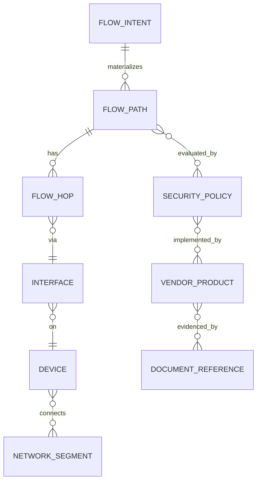

# infraflow: 자연어 기반 네트워크·인프라 플로우 설계·추천 플랫폼 구축 심층 리서치

## 요약

infraflow는 “자연어 → (표준화된 인프라/네트워크 지식모델) → 다이어그램·플로우·정책·벤더/클라우드 매핑 → 검증/설명”을 일관된 파이프라인으로 제공하는 플랫폼으로 정의하는 것이 가장 견고하다. 핵심은 LLM 자체가 아니라, **벤더 중립의 정규화(ontology + source-of-truth)와 검증 체계**이며, LLM은 이를 *생성·편집·설명·질의·컨설팅*에 쓰는 인터페이스/오케스트레이터 역할을 맡는다. citeturn3search4turn3search2turn11search3

구현 관점에서 Claude Code는 코드베이스를 이해하고 파일 편집/명령 실행 등 “에이전틱 개발”에 적합하므로, infraflow의 개발·실험(“vibe coding”) 속도를 올리는 도구로 배치하되, **프로덕션에서의 정합성은 그래프/정책/스키마 검증으로 담보**해야 한다. citeturn0search0turn9search0turn3search2

학습/역량 측면에서는 (A) 네트워크·라우팅·오버레이·플로우 텔레메트리, (B) 클라우드 네트워킹(허브-스포크·트랜짓), (C) 보안 프레임워크(Zero Trust, CSF 2.0, ATT&CK), (D) 온톨로지/그래프 모델링(RDF/OWL/SHACL/JSON-LD), (E) LLM 도구사용·RAG·구조화 출력(OpenAPI/JSON Schema) 순으로 **“기초 → 정규화 모델 → 자동화/추천”**을 쌓는 로드맵이 효율적이다. citeturn0search1turn0search2turn2search1turn2search4turn3search4turn13search0turn13search1

추천/컨설팅 엔진은 “요구사항 분류 → 아키텍처 패턴 후보 생성 → 벤더/제품 매핑 → 제약조건 필터링(Policy as Code) → 다기준 점수화 + 근거 설명”의 5단 구조가 재현성과 감사 가능성을 동시에 높인다. citeturn11search3turn0search1turn6search3

---

## 제품 비전과 참조 아키텍처

infraflow의 제품 능력을 한 문장으로 압축하면 **“자연어 기반 인프라 설계/운영 지식의 ‘정규화·가시화·검증·추천’ 엔진”**이다. 이를 위해 기능을 다음 네 가지로 분해해 설계하는 것이 실전적이다.

**자연어 설계(Generate)**: 사용자가 “요구사항(규모/가용성/보안/연결/규제)”을 입력하면, 플랫폼은 내부 지식모델(온톨로지 + 그래프)을 바탕으로 아키텍처 구성요소와 연결(플로우)을 생성하고, 여기에 클라우드/벤더별 대안을 제시한다. 클라우드 설계 품질의 기준틀로는 AWS/Azure/GCP의 Well-Architected 프레임워크를 “평가 기준(채점 rubric)”으로 내장하는 방식이 효과적이다. citeturn0search1turn0search2turn0search3

**편집(Modify)**: 생성 결과는 다이어그램 캔버스에서 노드/엣지 편집으로 수정되고, 수정은 “그래프 변경(diff) → 스키마/정책 검증 → 설명 갱신”으로 이어져야 한다. 이때 허브-스포크와 같은 레퍼런스 토폴로지(예: Azure 허브-스포크)는 패턴 라이브러리로 제공하면 사용성이 좋다. citeturn6search3

**설명/컨설팅(Explain/Consult)**: 구조·플로우·정책의 근거를 표준 문서/RFC/벤더 문서에 연결하여 “왜 이 구성이 맞는지”를 설명한다. 예를 들어 VPC Flow Logs, NSG Flow Logs 같은 관측 데이터(telemetry) 소스까지 함께 제시하면 운영 관점의 설득력이 커진다. citeturn16search0turn16search1

**검증(Validate)**: 최종 산출물은 “형식적 검증(스키마/제약)”과 “운영적 검증(보안/가용성/관측 가능성 체크리스트)”로 나뉜다. 전자는 SHACL 같은 그래프 제약 언어, 후자는 Policy as Code(예: OPA)로 자동화하기 좋다. citeturn3search2turn11search3

UI/UX 관점의 추천은 “LLM 채팅창”보다 **‘설계 편집기(editor) + 근거패널(evidence) + 검증패널(validation)’** 3분할을 중심으로 잡는 것이다. 다이어그램 표준은 Mermaid(텍스트 기반)로 빠른 생성/리뷰를, 시각 편집은 노드 기반 UI 라이브러리(React Flow)로 정밀 편집을 제공하는 “하이브리드”가 실무 적합성이 높다. citeturn10search15turn10search1

image_group{"layout":"carousel","aspect_ratio":"16:9","query":["hub and spoke network topology diagram", "AWS VPC architecture diagram", "interactive node-based editor React Flow example", "knowledge graph visualization Cytoscape.js example"],"num_per_query":1}

**권장 시각 컴포넌트(핵심만)**  
- 중앙 캔버스: 토폴로지/플로우(노드·엣지) 편집(React Flow) citeturn10search1  
- 참조 그래프 뷰(옵션): 지식그래프 탐색/하이라이트(Cytoscape.js) citeturn10search0turn10search17  
- 오른쪽 인스펙터: 선택 노드의 속성(메타데이터·벤더 매핑·근거 링크·정책 영향)  
- 하단 검증 패널: “스키마 통과/실패, 위반 규칙, 권장 수정안”  
- 근거 패널: RFC/클라우드 아키텍처 페이지/벤더 가이드의 ‘우선 소스’ 링크 모음

---

## 지식 영역과 권위 자료

아래 표는 infraflow 구축에 필요한 지식 영역을 “벤더 중립 기반 → 벤더/클라우드 심화 → 플랫폼 구현 역량”으로 정렬한 것이다(실무 중심). 표의 “우선 자료”는 가능한 한 표준/공식 문서를 우선으로 배치했다.

| 영역 | 무엇을 할 수 있어야 하나 | 우선 학습 키워드 | 우선 자료(권위/공식) |
|---|---|---|---|
| 네트워크 기초 | 주소/서브넷/라우팅/세그먼트로 플로우를 설명·추론 | RFC1918 사설주소, IPv6, 라우팅(BGP), 오버레이(VXLAN) | RFC1918, RFC8200, RFC4271, RFC7348 citeturn1search0turn1search1turn1search2turn1search3 |
| 플로우/관측(telemetry) | “어떤 트래픽이 어디로 흐르는지”를 수집·정규화·시각화 | IPFIX, NetFlow, sFlow, 클라우드 Flow Logs | RFC7011(IPFIX), Cisco NetFlow 개요, sFlow 스펙, VPC Flow Logs, NSG Flow Logs citeturn5search0turn5search1turn5search2turn16search0turn16search1 |
| 네트워크 자동화/모델링 | 장비/구성/상태를 “모델”로 다루고 API로 자동화 | YANG, OpenConfig, Source of Truth | RFC7950(YANG), OpenConfig 모델, NetBox(SoT) citeturn4search0turn4search5turn4search3 |
| 클라우드 네트워킹 | 허브-스포크/트랜짓/하이브리드 연결 패턴 설계 | Transit hub, ExpressRoute/VPN, Well-Architected | AWS Well-Architected, Azure Well-Architected, Azure hub-spoke, Transit Gateway 문서 citeturn0search1turn0search2turn6search3turn6search10 |
| 컨테이너/서비스 네트워킹 | Pod/Service/Ingress/NetworkPolicy로 L3/L4 정책 설계 | Kubernetes NetworkPolicy, Ingress | Kubernetes NetworkPolicies/Ingress 문서 citeturn12search1turn12search5 |
| 인프라 as Code | 인프라를 코드로 선언/버전관리/재현 | Terraform, 구성 언어 | Terraform 소개/언어 문서 citeturn12search0turn12search21 |
| 보안 프레임워크 | 위협·통제·아키텍처 원칙을 추천 엔진에 반영 | CSF 2.0, Zero Trust, ATT&CK, CIS Controls | NIST CSF 2.0, NIST SP 800-207, MITRE ATT&CK, CIS Controls v8 citeturn2search1turn2search4turn2search2turn2search3 |
| 온톨로지/지식그래프 | 인프라 구성요소·관계·제약을 기계가 이해하게 모델링 | RDF, OWL 2, SHACL, SKOS, JSON-LD | W3C RDF/OWL/SHACL/SKOS/JSON-LD citeturn3search4turn3search1turn3search2turn3search3turn15search2 |
| API/시스템 설계 | 도구·서비스를 표준 스키마로 연결하고 자동화 | OpenAPI, JSON Schema, gRPC, GraphQL | OpenAPI 스펙, JSON Schema 2020-12, gRPC, GraphQL 스펙 citeturn13search0turn13search1turn13search2turn13search3 |
| LLM/에이전트 통합 | 도구호출·검색·구조화 출력·안전장치 | Tool use, Prompting BP, RAG, ReAct | Claude tool use/프롬프트 BP, RAG 논문, ReAct 논문 citeturn9search0turn15search0turn9search1turn9search2 |

**벤더/클라우드 심화(“깊게 팔” 우선순위)**  
- (네트워크 패브릭/SDN) ACI의 spine-leaf, 정책 기반 운영 개념과 구성요소(APIC 등). citeturn7search6turn7search14turn16search3  
- (WAN) Catalyst SD-WAN의 컨트롤 컴포넌트(vManage/vSmart/vBond 명칭 변경 포함)와 설계 가이드 기반 토폴로지 모델링. citeturn7search11  
- (보안 패브릭) Security Fabric을 “기능/연동 관계”로 정규화하여 그래프에 표현(디바이스 간 내비게이션/통합 정보). citeturn7search1turn7search5  
- (클라우드 네트워크 허브) Transit Gateway(허브 라우팅), Direct Connect 연계, Azure 허브-스포크 및 ExpressRoute/VPN 레퍼런스. citeturn6search6turn6search10turn6search3turn6search15  

---

## 학습 로드맵과 마일스톤

학습 시간은 “주 10–15시간(파트타임)” 기준으로 산정했다. 일정이 빡빡하면 각 단계의 실습만 먼저 수행하고, 이론은 필요 시 보강하는 방식이 infraflow 유형의 제품 개발에 더 맞는다(실습이 곧 데이터/온톨로지 요구사항을 드러냄).

| 단계 | 권장 기간(파트타임) | 목표 산출물(마일스톤) | 추천 학습/랩(공식 중심) |
|---|---:|---|---|
| 기반 네트워크·플로우 | 3–5주 (30–60h) | (1) “서비스-to-서비스” 플로우를 L3/L4로 서술하는 템플릿 (2) IP/라우팅/오버레이 용어집 | CCNA 범위로 네트워크 기초를 프레임화(시험 토픽을 체크리스트로 활용). citeturn6search1 RFC1918/IPv6/BGP/VXLAN을 “플로우 관점”으로 읽기. citeturn1search0turn1search1turn1search2turn1search3 |
| 클라우드 네트워킹 | 4–6주 (40–80h) | (1) AWS: VPC + Flow Logs 수집 (2) Azure: 허브-스포크 샘플 + NSG Flow Logs | AWS Networking Basics(학습용), VPC Flow Logs 문서. citeturn14search3turn16search0 Azure Virtual Network 학습 모듈, 허브-스포크 레퍼런스 아키텍처, NSG Flow Logs. citeturn14search2turn6search3turn16search1 |
| 자동화·SoT 구축 | 3–5주 (30–60h) | (1) SoT 데이터모델 초안 (2) 장비/서브넷/정책을 API로 CRUD | NetBox를 “네트워크 SoT”로 이해(모델+API). citeturn4search3turn4search15 YANG/OpenConfig로 “벤더 중립 구성 모델” 감각 만들기. citeturn4search0turn4search5 |
| 보안 프레임워크 내장 | 3–5주 (30–60h) | (1) 요구→통제(controls) 매핑 규칙(초안) (2) Zero Trust 관점 체크리스트 | NIST CSF 2.0(거버넌스/리스크 구조), NIST SP 800-207(ZTA), ATT&CK, CIS Controls. citeturn2search1turn2search4turn2search2turn2search3 |
| 온톨로지·지식그래프 | 5–8주 (50–100h) | (1) infraflow ontology v0.1 (2) SHACL 검증 (3) 샘플 그래프 질의 | RDF/OWL/SHACL/SKOS/JSON-LD로 “표현-검증-교환” 체계 확립. citeturn3search4turn3search1turn3search2turn3search3turn15search2 |
| LLM 통합·제품화 | 6–10주 (60–120h) | (1) NL→구조화(JSON)→그래프 반영 (2) NL→Mermaid 생성/편집 (3) 추천 PoC | Claude tool use + prompting best practices 적용. citeturn9search0turn15search0 RAG/에이전트(도구사용) 설계는 RAG/ReAct를 참고. citeturn9search1turn9search2 OpenAPI/JSON Schema로 API·출력 표준화. citeturn13search0turn13search1 |

**샘플 프로젝트(학습과 동시에 ‘제품 자산’이 되는 형태로 설계)**  
- “플로우 정규화 프로젝트”: IPFIX/NetFlow/sFlow/클라우드 Flow Logs의 공통 필드를 뽑아 **FlowEvent 스키마(정규화)**를 만들고, 저장·검색·집계까지 구현. citeturn5search0turn5search1turn5search2turn16search0turn16search1  
- “패턴 라이브러리 프로젝트”: 허브-스포크, 트랜짓 허브, 하이브리드(ExpressRoute/VPN failover 등)를 템플릿으로 구성(다이어그램+구성요소+검증규칙). citeturn6search3turn6search15turn6search6  
- “정책 검증 프로젝트”: Kubernetes NetworkPolicy 같은 L3/L4 규칙을 그래프 상의 FlowPath에 적용해 allow/deny를 계산하고, 위반 시 수정안을 제시. citeturn12search1  

**추천 교재(정확한 개념 정리용)**  
- 네트워크 기초: Pearson의 *Computer Networking: A Top-Down Approach*는 애플리케이션 계층부터 내려오며 핵심 개념을 빠르게 잡는 방식으로 소개된다. citeturn14search1  
- 온톨로지: Elsevier/Morgan Kaufmann의 *Semantic Web for the Working Ontologist*는 RDFS/OWL 기반 모델링을 예제로 다룬다. citeturn15search10  
- 시스템/운영: Google의 SRE 도서는 신뢰성과 보안을 함께 다루는 운영 원칙의 레퍼런스로 활용할 수 있다. citeturn12search3  

---

## 온톨로지와 데이터 모델 설계

infraflow의 온톨로지는 “다이어그램을 그리기 위한 스키마”가 아니라, **플로우의 생성/검증/추천을 가능하게 하는 추론 가능한 지식모델**이어야 한다. 권장 접근은 다음의 “역할 분담”이다.

**표현(Representation)**  
- RDF: 트리플(subject–predicate–object) 기반의 그래프 표현(지식그래프의 공통 기반). citeturn3search4  
- OWL 2: 클래스/속성/개체와 의미론을 확장해 “개념 모델”을 정의(벤더 중립 개념의 공리화). citeturn3search1  
- SKOS: 제품/기능/패턴 분류체계를 유연하게 관리(동의어/상하위/관련어). citeturn3search3  
- JSON-LD: JSON 기반으로 Linked Data를 직렬화해 API·저장·프론트엔드에 전달. citeturn15search2  

**검증(Validation)**  
- SHACL: RDF 그래프가 만족해야 하는 조건(필수 속성, 값 범위, 관계 제약)을 “shapes”로 정의해 검증. citeturn3search2  

### 권장 엔티티 타입(최소 코어)

- **Asset/Resource 계열**: Device, Interface, Link, NetworkSegment, Subnet, Endpoint(Host/VM/Pod), ApplicationService  
- **Control/Policy 계열**: RoutingPolicy, SecurityPolicy(ACL/FirewallRule), NAT, LoadBalancerPolicy, Identity(사용자/워크로드 ID)  
- **Flow 계열**: FlowIntent(요구/의도), FlowPath(추론된 경로), FlowEvent(관측 로그)  
- **Vendor/Mapping 계열**: VendorProduct, VendorFeature, DeploymentModel(SaaS/Appliance/VM), DocumentReference(근거), Capability(벤더 중립 기능)

### 관계(relationships) 설계 가이드

관계는 “물리 연결”과 “논리/정책 적용”을 분리하면 유지보수가 쉬워진다.

- 물리/토폴로지: `connectedTo`, `attachedTo`, `memberOf`  
- 논리 경로: `routesTo`, `reachableFrom`, `transitsVia`  
- 정책 적용: `enforcedBy`, `allows`, `denies`, `translatedBy(NAT)`  
- 운영/근거: `observedBy(telemetry)`, `documentedBy(reference)`

### 메타데이터 스키마(운영/추천에 필수)

- **Provenance(출처)**: source_type(standards/vendor/internal), source_id(URL/문서키), extracted_by(파서/수기/LLM), extracted_at  
- **신뢰도/품질**: confidence(0–1), verification_status(verified/needs_review), last_validated_at  
- **버전/시간**: ontology_version(semver), entity_version, valid_from/valid_to(시간축 모델링)  
- **호환성**: vendor_version_range, api_version, deployment_region/zone(클라우드)

### 벤더 제품 매핑 규칙(핵심 원칙)

1) **개념(Concept)과 제품(Product)을 동일시하지 않는다.** 예: “Firewall”는 개념, 특정 NGFW는 구현(implements)이다. citeturn16search2  
2) **매핑은 ‘Capability’ 중심으로 한다.** “기능 집합(예: L3/L4 정책, NAT, VPN, 로깅)”을 기준으로 후보를 찾고, 마지막에 제품/라이선스로 구체화한다.  
3) **문서 근거 링크를 매핑의 1급 시민으로 둔다.** 추천 엔진이 “왜 이 제품/서비스인지”를 설명할 때, 공식 문서 링크가 최종 근거가 된다. citeturn0search1turn7search6turn16search0  

### 샘플 온톨로지 매핑 테이블

| 공통 컴포넌트(개념) | 핵심 속성 예시 | 대표 관계 예시 | 벤더/클라우드 예시(구현체) |
|---|---|---|---|
| Transit Hub | routing_domain, attachments, bandwidth, region | `transitsVia`, `attachedTo(VPC/VNet)` | AWS Transit Gateway(허브) citeturn6search10turn6search21 |
| Hub-Spoke Topology | hub_services(DNS/Firewall), isolation, peering_rules | `memberOf(spoke)`, `routesTo(hub)` | Azure hub-spoke 레퍼런스 citeturn6search3 |
| Flow Log Source | capture_scope, retention, sink(S3/Storage), fields | `observedBy`, `exportsTo` | VPC Flow Logs citeturn16search0 / NSG Flow Logs citeturn16search1turn16search5 |
| NetworkPolicy | selector, ports, direction, action | `allows/denies`, `enforcedBy(CNI)` | Kubernetes NetworkPolicy citeturn12search1 |
| SoT(소스 오브 트루스) 오브젝트 | object_type, api_path, identifiers | `documentedBy`, `syncedFrom` | NetBox(모델+API) citeturn4search3turn4search15 |
| Device Config Model | config/state schema, RPC/notification | `configuredBy`, `reportsState` | YANG citeturn4search0 / OpenConfig(벤더중립) citeturn4search5 |
| Data Center Fabric(SDN) | spine_leaf, policy_model, tenancy | `connectedTo`, `enforcedBy(policy)` | ACI 설계 가이드(스파인-리프) citeturn7search6 |
| Security Fabric(통합) | device_graph, shared_context, telemetry | `integratesWith`, `sharesContext` | Security Fabric 개요 citeturn7search1turn7search5 |
| Hardware Mgmt API | resource_model, events, auth | `managedBy`, `reportsEvent` | Redfish(REST 기반 시스템 관리) citeturn4search6turn4search10 |

### Mermaid로 보는 엔티티 관계 예시(간소화)



---

## LLM 통합 및 오케스트레이션

infraflow의 LLM 통합 목표는 “문장 생성”이 아니라 다음을 안정적으로 수행하는 것이다.

1) 자연어를 **정규화된 의도(FlowIntent) + 제약조건(Constraints)**으로 변환  
2) 그래프/문서에서 근거를 찾아 **RAG 기반으로 생성**  
3) 산출물을 **구조화(JSON/스키마)**하고 **검증(규칙/정책)** 후 사용자에게 제시  
4) 편집·반복되더라도 일관된 결과(재현성)를 유지

Claude API는 tool use(도구호출) 방식을 공식 문서로 제공하므로, infraflow의 그래프 질의/정책평가/문서검색을 “툴”로 모델링하는 것이 자연스럽다. citeturn9search0 또한 프롬프트 설계는 Anthropic의 prompting best practices를 기준으로 “시스템 프롬프트에 역할/제약/출력 스키마를 명시”하는 방향이 안전하다. citeturn15search0

**권장 프롬프트 패턴(실전형)**  
- **Schema-first**: 먼저 JSON Schema로 출력 형태를 고정하고(검증 가능), LLM은 채우기만 하도록 설계. citeturn13search1turn13search5  
- **Evidence-first**: 답변 전 “그래프/문서 근거를 먼저 수집”하고, 부족하면 “불확실”로 표기. (RAG의 기본 취지) citeturn9search1  
- **Plan-and-act(에이전틱)**: 툴 호출과 관찰을 섞어 정확도를 높이는 ReAct류의 패턴을 참조하되, 내부적으로는 “관찰 가능한 로그(툴 호출 기록)”를 남겨 감사 가능성을 높인다. citeturn9search2turn9search0  

### 시스템 메시지(예시)와 구조화 출력(예시)

```text
[System]
너는 infraflow의 “인프라/네트워크 설계·추천” 에이전트다.
반드시 다음 원칙을 지켜라:
1) 모든 설계/추천은 내부 온톨로지(그래프)와 근거 문서 링크를 기반으로 한다.
2) 산출물은 JSON Schema에 맞는 JSON으로 먼저 출력하고, 그 다음 사람이 읽을 설명을 붙인다.
3) 검증 단계(SHACL/정책 룰)를 통과하지 못하면, "needs_fix"로 표시하고 수정안을 제시한다.
4) 확실하지 않은 내용은 추측하지 말고, 확인이 필요한 항목으로 분리한다.
```

도구/오케스트레이션 측면에서는 OpenAPI로 툴을 표준화하면(발견/테스트/클라이언트 생성), LLM 도구 라우팅과 백엔드 구현을 분리하기 쉽다. citeturn13search0turn13search10

**API 오케스트레이션 권장 패턴(비동기·검증 중심)**  
- `ParseIntent`(NL→FlowIntent JSON) → `QueryGraph`(후보 구성요소/패턴) → `RetrieveDocs`(근거) → `Synthesize`(다이어그램/추천) → `Validate`(SHACL+정책) → `Explain`(근거 링크 포함)  
- 특히 `Validate`는 LLM 밖(결정적 코드)에서 수행해 “항상 같은 입력이면 같은 판정”이 나오게 하는 것이 중요하다. citeturn3search2turn11search3  

---

## 추천·컨설팅 엔진 설계

추천 엔진을 “LLM이 알아서 추천”으로 두면, 벤더 편향과 비일관성이 커진다. 대신 **지식그래프 + 규칙/정책 + 점수화**로 “틀을 고정”하고, LLM은 *설명과 인터랙션*에 집중시키는 구성이 안정적이다.

### 매칭 알고리즘(권장 5단 파이프라인)

**요구사항 정규화**: 자연어 요구를 다음으로 구조화한다.  
- 기능 요구: 연결(하이브리드/멀티리전), 보안(세그먼테이션/ZT), 관측(Flow Logs/SIEM), 운영(자동화/SoT)  
- 비기능 요구: 성능/신뢰성/비용/규정  
이때 Well-Architected 프레임워크의 품질축을 “비기능 요구의 기본 분류”로 사용하면 일관된 평가가 가능하다. citeturn0search1turn0search2

**패턴 후보 생성**: 예) 허브-스포크, 트랜짓 허브, 하이브리드(ExpressRoute+VPN failover) 등. Azure의 허브-스포크 레퍼런스 아키텍처는 패턴 정의의 좋은 기준점이 된다. citeturn6search3turn6search15

**벤더/제품 매핑**: 온톨로지의 `Capability` 노드와 제품(구현체)을 연결해 후보를 만든다(예: “transit hub” capability → Transit Gateway). citeturn6search10

**제약조건 처리(하드/소프트 분리)**  
- 하드 제약(필수): 규정, 특정 환경(온프레 필수), 특정 계층 통제(예: L3/L4 정책), 예산 상한 등  
- 소프트 제약(선호): 특정 벤더 선호, 운영팀 숙련도, 기존 계약 등  
하드 제약은 OPA 같은 정책 엔진으로 “통과/실패”를 결정하고, 소프트 제약은 점수화로 반영하는 전략이 감사 가능성과 유지보수성이 높다. citeturn11search3turn11search12

**점수화(Scoring) 기준 예시**  
- 적합성(Fit): 요구 기능 충족률  
- 보안(Security): CSF/Zero Trust 체크리스트 대응 정도 citeturn2search1turn2search4  
- 운영성(Operability): 관측(Flow Logs/Telemetry)·자동화 연동 citeturn16search0turn16search1turn4search3  
- 성능/확장성: 토폴로지/라우팅 복잡도, 병목 가능성  
- 비용/락인: 운영·라이선스·대체 가능성(정성/정량 혼합)

### 예시 의사결정 규칙(샘플)

- “VPC/VNet이 3개 이상이고(또는 계정/구독이 다수) 상호 라우팅이 복잡해지면”, 중앙 허브(Transit hub) 패턴을 우선 검토한다(라우팅을 한 곳에 통합). citeturn6search6turn6search21  
- “워크로드 격리(Dev/Test/Prod) + 공용 서비스(DNS/방화벽)가 필요하면”, 허브-스포크를 기본 패턴으로 시작한다. citeturn6search3  
- “트래픽 규칙이 Pod 단위로 자주 변하고 L3/L4 제어가 필요하면”, Kubernetes NetworkPolicy 기반 정책을 우선 모델링하고(단, CNI가 enforcement 지원 필요), 이후 클라우드/벤더 정책으로 확장한다. citeturn12search1  

---

## 구현 스택, 파일럿 검증, 리스크 관리

### 구현 스택 제안(오픈엔디드 전제)

infraflow는 “지식그래프 + 검색(RAG) + 편집 UI + 검증”이 핵심이므로, 데이터 계층을 먼저 결정하고 그 위에 LLM/UX를 얹는 것이 실패 확률이 낮다.

| 레이어 | 옵션 | 장점 | 주의점/트레이드오프(요약) | 근거(공식) |
|---|---|---|---|---|
| 그래프 DB | Amazon Neptune | SPARQL/RDF 및 Gremlin/openCypher 등 그래프 질의 지원(혼합 모델 고려에 유리). | 운영·비용·이식성(클라우드 종속) 고려 필요. | Neptune이 SPARQL/Gremlin/openCypher 지원을 언급. citeturn11search10turn11search0turn11search7 |
| 그래프 DB | Neo4j | Property graph + Cypher 생태계가 강함(쿼리 생산성, GDS 등). | RDF/OWL/SHACL 중심 설계면 변환/병행 전략 필요. | Cypher가 Neo4j의 선언적 질의 언어임. citeturn11search1turn11search5 |
| 벡터 DB | Postgres + pgvector | 운영 단순(기존 RDB와 통합), 벡터 유사도 검색 제공. | 대규모 벡터/고성능 ANN 요구 시 확장 전략 필요. | pgvector 기능 요약. citeturn11search2 |
| 정책/제약 엔진 | OPA | 정책을 코드로 통일(마이크로서비스, K8s, CI/CD 등). | 정책 언어/운영 체계 학습 필요. | OPA 정의 및 적용 범위. citeturn11search3 |
| IaC/재현성 | Terraform | 인프라를 선언형 파일로 정의하고 버전/재사용/공유. | 클라우드별 provider 차이와 상태(state) 관리가 중요. | Terraform 소개. citeturn12search0 |
| 다이어그램 생성 | Mermaid | 텍스트 기반 다이어그램 문법(빠른 생성/리뷰). | 복잡한 편집은 별도 캔버스 필요. | Mermaid 문법 레퍼런스. citeturn10search15turn10search19 |
| 시각 편집기 | React Flow | 노드 기반 편집 UI 구현에 특화. | 그래프 데이터 모델(노드/엣지)와 온톨로지 모델을 매핑하는 설계가 필요. | React Flow 소개. citeturn10search1 |
| 지식그래프 뷰 | Cytoscape.js | 상호작용 그래프 시각화 및 분석. | 대규모 그래프 성능/레이아웃 최적화 필요. | Cytoscape.js 소개. citeturn10search0turn10search17 |
| LLM 도구호출 | Claude tool use | 툴 결과를 콘텐츠 블록으로 반환하는 툴 사용 패턴 제공. | 도구 과다 호출/근거 부실을 방지하는 정책 필요. | tool use 구현 가이드. citeturn9search0turn15search0 |

> “베스트 1개”를 고르라면: **그래프(Neptune 또는 Neo4j) + Postgres(pgvector) + OPA + React Flow + Mermaid + Claude tool use**의 조합이 infraflow의 핵심 요구(모델/추천/검증/편집)에 직접 대응한다. citeturn11search10turn11search1turn11search2turn11search3turn10search1turn10search15turn9search0  

### UI 플로우차트(샘플)

```mermaid
flowchart TD
  A[자연어 요구 입력] --> B[Intent 파싱/정규화 JSON]
  B --> C[그래프 질의: 패턴/구성요소 후보]
  C --> D[문서 검색(RAG): 표준/RFC/벤더 근거]
  D --> E[초안 생성: 다이어그램(Mermaid) + 구조화 BOM]
  E --> F[검증: SHACL + 정책(OPA)]
  F -->|통과| G[추천/설명/근거 링크 제공]
  F -->|실패| H[위반 원인 + 자동 수정안]
  G --> I[시각 편집(React Flow)]
  I --> F
```

### 파일럿 검증 계획(KPIs 중심)

파일럿은 “정답이 정의되는” 테스트 케이스를 반드시 포함해야 한다. 즉, **(1) 표준 패턴(허브-스포크 등)이라는 정답이 있는 케이스**, **(2) 보안 정책 위반이라는 정답이 있는 케이스**, **(3) 로그/플로우 데이터 파싱 정확도**가 대표적이다. citeturn6search3turn12search1turn16search0turn16search1

| 범주 | 테스트 케이스 예시 | KPI(권장) | 평가 방법 |
|---|---|---|---|
| 설계 정확도 | 허브-스포크/트랜짓 허브 템플릿 생성 | 템플릿 구성요소 충족률, 라우팅 일관성 | “골든 그래프”와 구조 비교(노드/엣지 매칭) |
| 정책/보안 | NetworkPolicy/방화벽 규칙으로 allow/deny 판정 | 위반 탐지 정밀도/재현율, 오탐률 | 규칙 기반 시뮬레이션 결과와 비교 citeturn12search1 |
| 근거 품질 | 추천 근거 링크 품질 | 근거 링크 포함률, ‘공식 문서’ 비율 | 링크 도메인/출처 타입으로 자동 점검 |
| RAG 안정성 | 최신 문서 반영/환각 감소 | 무근거 주장률(%) | 답변 항목별 근거 존재 여부 샘플링 citeturn9search1turn9search2 |
| 운영성 | Flow Logs 수집/정규화 | 파싱 성공률, 지연, 필드 누락률 | VPC/NSG Flow Logs 샘플 리플레이 citeturn16search0turn16search1 |

### 리스크·한계와 완화 전략

**정확도/환각**: 지식이 필요한 답변은 RAG로 근거를 끌어오고, 툴 호출을 섞어 정확도를 높이는 패턴(ReAct류)을 채택하되, 최종 판정/검증은 SHACL/정책 엔진으로 분리한다. citeturn9search1turn9search2turn3search2turn11search3

**벤더 편향**: 추천 엔진을 “Capability→패턴→제품”의 계층으로 고정하고, 평가 기준은 Well-Architected 및 보안 프레임워크의 축으로 표준화한다. citeturn0search1turn0search2turn2search1

**문서·버전 드리프트**: 벤더 문서는 업데이트가 잦다. 따라서 온톨로지/지식베이스는 (a) 문서 버전/검토일 메타데이터, (b) valid_from/valid_to, (c) 정기 재검증 파이프라인을 포함해야 한다. 클라우드 프레임워크 문서도 개정 이력이 존재한다. citeturn0search1turn0search10

**보안/공급망 리스크**: 장비/소프트웨어 취약점은 CVE로 추적되고, NVD는 취약점 관리 데이터 저장소로 사용된다. 벤더 PSIRT(예: FortiGuard PSIRT, Cisco advisories)를 “데이터 소스”로 연동하면 추천 시 “패치/영향”까지 반영 가능하다. citeturn8search2turn8search0turn8search1

**민감정보 노출**: 플로우/토폴로지는 내부 구조를 노출한다. 따라서 (1) 저장 시 암호화/접근통제, (2) LLM 전송 전 민감 필드 마스킹, (3) 테넌트 격리, (4) 감사 로그를 기본값으로 설계해야 한다(특히 SoT와 연동 시). citeturn4search3turn16search0

### 우선 참고 링크 모음(공식/권위 중심)

아래는 “infraflow 구축 시 우선순위가 높은 1차 자료”를 카테고리별로 정리한 링크다(한국어/영어 혼합).

```text
[Claude / Tool use / Prompting]
- Claude Code overview: https://code.claude.com/docs/en/overview
- Claude API Docs (home): https://platform.claude.com/docs/en/home
- Tool use implementation: https://platform.claude.com/docs/en/agents-and-tools/tool-use/implement-tool-use
- Claude prompting best practices: https://platform.claude.com/docs/en/build-with-claude/prompt-engineering/claude-prompting-best-practices

[Cloud Well-Architected]
- AWS Well-Architected Framework: https://docs.aws.amazon.com/wellarchitected/latest/framework/welcome.html
- Azure Well-Architected Framework: https://learn.microsoft.com/en-us/azure/well-architected/
- Google Cloud Well-Architected Framework: https://docs.cloud.google.com/architecture/framework

[AWS Networking / Flow]
- What is Transit Gateway: https://docs.aws.amazon.com/vpc/latest/tgw/what-is-transit-gateway.html
- VPC Flow Logs: https://docs.aws.amazon.com/vpc/latest/userguide/flow-logs.html

[Azure Networking / Flow]
- Hub-spoke topology reference: https://learn.microsoft.com/en-us/azure/architecture/networking/architecture/hub-spoke
- ExpressRoute + VPN failover reference: https://learn.microsoft.com/en-us/azure/architecture/reference-architectures/hybrid-networking/expressroute-vpn-failover
- NSG flow logs overview (ko): https://learn.microsoft.com/ko-kr/azure/network-watcher/nsg-flow-logs-overview

[Networking Standards (RFC)]
- RFC1918 (Private IPv4): https://datatracker.ietf.org/doc/html/rfc1918
- RFC8200 (IPv6): https://datatracker.ietf.org/doc/html/rfc8200
- RFC4271 (BGP-4): https://datatracker.ietf.org/doc/html/rfc4271
- RFC7348 (VXLAN): https://datatracker.ietf.org/doc/html/rfc7348
- RFC7011 (IPFIX): https://datatracker.ietf.org/doc/html/rfc7011
- RFC7950 (YANG 1.1): https://datatracker.ietf.org/doc/html/rfc7950

[Security Frameworks]
- NIST CSF 2.0 (PDF): https://nvlpubs.nist.gov/nistpubs/CSWP/NIST.CSWP.29.pdf
- NIST SP 800-207 Zero Trust (PDF): https://nvlpubs.nist.gov/nistpubs/specialpublications/NIST.SP.800-207.pdf
- MITRE ATT&CK: https://attack.mitre.org/
- CIS Controls v8: https://www.cisecurity.org/controls/v8
- NVD (취약점 DB): https://nvd.nist.gov/

[Ontology / Knowledge Graph Standards]
- RDF 1.1 Concepts: https://www.w3.org/TR/rdf11-concepts/
- OWL 2 Overview: https://www.w3.org/TR/owl2-overview/
- SHACL: https://www.w3.org/TR/shacl/
- SKOS Reference: https://www.w3.org/TR/skos-reference/
- JSON-LD 1.1: https://www.w3.org/TR/json-ld11/

[API / Schema]
- OpenAPI Spec: https://swagger.io/specification/
- JSON Schema 2020-12: https://json-schema.org/draft/2020-12
- gRPC intro: https://grpc.io/docs/what-is-grpc/introduction/
- GraphQL Spec: https://spec.graphql.org/

[Visualization]
- Mermaid docs: https://mermaid.js.org/
- React Flow: https://reactflow.dev/
- Cytoscape.js: https://js.cytoscape.org/

[Source of Truth / Automation]
- NetBox docs: https://netboxlabs.com/docs/netbox/
- OpenConfig models: https://www.openconfig.net/projects/models/
- OPA docs: https://openpolicyagent.org/docs
- Terraform intro: https://developer.hashicorp.com/terraform/intro
```